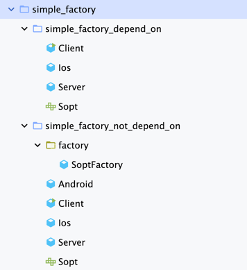
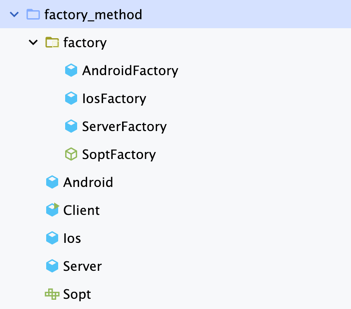

# Factory Method Pattern 코드 구조

## Simple Factory 

- simple_factory_depend_on : 구현 클래스에 의존한다 
- simple_factory_not_depend_on : 구현 클래스에 의존하지 않는다

## Factory Method

- factory_method : OCP를 지킨 팩토리 메서드 패턴

### 블로그
https://01codingjourney.tistory.com/entry/Design-Pattern-%ED%8C%A9%ED%86%A0%EB%A6%AC-%EB%A9%94%EC%84%9C%EB%93%9C-%ED%8C%A8%ED%84%B4Factory-Method-Pattern

블로그에도 포스팅 해놓았습니다. 많은 관심 부탁드립니다!